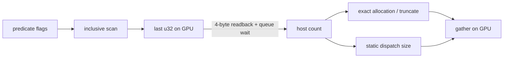
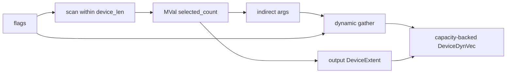

# proposal-del2d: Massively で del2d を高速化するための API 提案

状態: 検討用  
対象: Massively 0.84 以降  
利用事例: `del2d`

## 要約

Massively の現行 API は、GPU 上で計算した要素数・真偽値・reduction 結果を、次の GPU 処理へ渡す前に host の値へ戻す設計になっている。

特に `copy_where`、`remove_where`、`unique_by_key` は、scan の末尾にある `u32` 1 個を host に読み戻し、その値で出力を切り詰め、次の dispatch 数を決める。この転送量は 4 byte しかないが、問題は帯域ではなく、そこまでに enqueue された GPU queue の完了を CPU が待つ点にある。反復アルゴリズムでは、この同期が各ラウンドに何度も入り、GPU と CPU が直列に動いてしまう。

本提案では、次を追加する。

- GPU 上に値を保持する `MVal<R, T>`
- host が知る `capacity` と GPU が持つ `len` を組にした `DeviceExtent<R>`
- `DeviceExtent` を持つ `DeviceDynVec<R, T>`
- scalar を host に戻さず返す reduction / predicate API
- device length を生成・伝播する selection / scan / unique / sort API
- device length から `[x, y, z]` を生成する indirect-dispatch API

既存 API は互換性のため残す。新 API は readback を行わず、host 値が本当に必要になった境界だけ `read` を明示的に呼ぶ。

重要なのは、`MVal` だけを追加しても不十分なことである。下流の iterator、出力 allocation、scan、sort、dispatch が host の `usize` を要求するままなら、別の場所で同じ同期が発生する。device scalar、device length、capacity-backed storage、indirect dispatch を一つの機能として設計する必要がある。

## 背景: `del2d` で観測した性能

`del2d` は Massively 0.84 (`c642426`) を使い、ランダム点の Delaunay 三角形分割を実行している。同じ固定入力を `delaunator` ベースの CPU 実装と比較したローカル計測は次の通りだった。

環境は Radeon 680M、Criterion の sample size は 10。点生成と GPU upload は計測外、三角形分割と最後の GPU sync は計測内である。

| N | Massively / GPU | CPU | GPU / CPU |
|---:|---:|---:|---:|
| 256 | 1.758 s | 0.0308 ms | 57,107x |
| 1,024 | 4.222 s | 0.160 ms | 26,375x |
| 4,096 | 8.241 s | 0.843 ms | 9,775x |
| 16,384 | 29.448 s | 3.872 ms | 7,606x |

この比較はアルゴリズム差も含むため、device length 対応だけで CPU 比を逆転できることを示すものではない。しかし、現在の GPU 実装が計算 throughput ではなく host synchronization に強く制限されていることは、コード上の制御フローから確認できる。

`del2d/src/triangulate.rs` には、概ね次の二重の反復がある。

- 未挿入点がなくなるまで batch insertion を行う。
- illegal edge がなくなるまで edge flip を行う。

各ラウンド内では `unique_by_key`、`copy_where`、`remove_where`、`any_of` などを複数回呼ぶ。現行 Massively では、それぞれが scalar readback を起こし得る。したがって、ラウンド間に一度だけ同期しているのではなく、一つのラウンドの途中でも GPU queue が何度も分断される。

## 現行 API の問題

### 1. logical length が必ず host 値である

`massively/src/core/runtime.rs` の `DeviceVec` は、handle と host の `usize` を保持する。

```rust
pub struct DeviceVec<R: Runtime, T> {
    handle: cubecl::server::Handle,
    len: usize,
    // ...
}
```

`MStorage::len` と `MIter::len` も `Result<usize, Error>` を返す。この契約は、固定長の配列、host range による slice、事前 allocation には分かりやすい。一方で、GPU の predicate によって決まる長さを表せない。

### 2. selection が scan の結果を host に戻す

現行 `copy_where` の概略は次の通りである。

```rust
let capacity = input.len()? as usize;
let mut output = exec.alloc::<Item>(capacity);
let len = copy_where_into(exec, input, stencil, output.slice_mut(..))?;
output.truncate(len as usize);
```

内部では predicate flag を inclusive scan し、`SelectionControl::from_positions` が `last_u32` を呼ぶ。`last_u32` は末尾を 1 要素の buffer に copy した後、次を実行する。

```rust
Ok(exec.to_host(&output)?[0])
```

この host の `count` は、さらに以下に使われる。

- selected index buffer を正確な長さで allocation する。
- `count == 0` を host で判定する。
- gather の出力範囲を host range で作る。
- 返却する `DeviceVec` の `len: usize` を更新する。

`remove_where` と、`SelectionControl::from_flags` を使う `unique_by_key` も同じ構造を持つ。



### 3. reduction と predicate が host scalar を返す

`vector::reduce` は最終的に `result.read_first(exec)` を実行し、`read_first` は `exec.to_host` を呼ぶ。

そのため以下はすべて host synchronization point になる。

- `reduce -> T`
- `count_if -> usize`
- `all_of -> bool`
- `any_of -> bool`
- `none_of -> bool`
- `find_if -> Option<u32>`

API の返り値だけを見ると普通の即値なので、呼び出し側から synchronization point であることも見えにくい。

### 4. dispatch 数が host length からしか作れない

Massively の `cube_count_1d` は `usize` から `CubeCount::Static` を作る。したがって、前段の GPU kernel が出した長さを次の dispatch 数に使うには、いったん CPU に戻すしかない。

CubeCL の現在の依存 revision (`0a62060`) には既に以下がある。

- `CubeCount::Dynamic(Binding)`
- WGPU backend の `dispatch_workgroups_indirect`
- WGPU allocation の `BufferUsages::INDIRECT`

つまり lower layer の入口は存在するが、Massively の algorithm API から利用できていない。

### 5. 派生長も host で計算される

`del2d` では `winner_count * 2`、`triangle_count * 3`、`survivor_count + child_count` のような長さを頻繁に作る。

最初の `winner_count` だけを `MVal<u32>` にしても、次の配列を作るために `usize` へ戻した時点で同期が再発する。device length には、少なくとも以下の伝播が必要である。

- 同じ長さを保つ `transform`
- 長さを定数倍する expand / repeat
- 二つの長さを加える concat
- predicate で短くなる compact / unique
- scan/reduction の階層ごとの `ceil_div`
- device length からの counting range

## なぜ 4 byte の readback が高価なのか

readback のコストは 4 byte の PCIe/UMA 転送時間ではない。CPU が結果を読むためには、その値を生成した kernel だけでなく、同じ queue でそれより前に submit された依存処理が完了していなければならない。

現行の反復は次のように直列化される。

1. CPU が数個の kernel を enqueue する。
2. `copy_where` が count を読むため CPU が待つ。
3. CPU が count を見て allocation と次の dispatch を決める。
4. 次の数個の kernel を enqueue する。
5. `any_of` が bool を読むため CPU が再び待つ。
6. これを多数のラウンドで繰り返す。

GPU は小さい dispatch の間で仕事を失い、CPU も GPU の完了待ちになる。さらに exact-size allocation を反復ごとに行うため、scratch allocation と command encoding の負荷も増える。

速くするための優先順位は次の通りである。

1. 中間 scalar の host readback をなくす。
2. worst-case capacity を事前確保し、ping-pong buffer を再利用する。
3. device length を下流の全 algorithm に伝播する。
4. device length に応じて indirect dispatch する。
5. 反復の停止判定を毎ラウンドではなく epoch 境界まで遅らせる。

indirect dispatch は重要だが、最大 capacity 分を over-dispatch して kernel 内で `index < device_len` を判定するだけでも、まず readback は除去できる。最初の性能改善は synchronization の除去から得られる可能性が高い。

## 目標

- GPU で生成した scalar を、host を経由せず次の Massively operation が消費できる。
- 物理 allocation の大きさと論理長を分離する。
- compact 後の vector を transform、gather、scan、unique、sort へ渡せる。
- device length から dispatch workgroup 数を GPU 上で生成できる。
- 既存の固定長 API と source compatibility を保つ。
- host synchronization が発生する API を明示的に識別できる。
- zero length と capacity 境界を安全に扱う。
- SoA の複数 column が必ず一つの logical extent を共有する。

## 非目標

- GPU から新しい device allocation を作ること。WebGPU の compute shader は Massively の allocator を呼べない。
- indirect dispatch だけで任意回数の device-side `while` を実現すること。
- 最初の変更ですべての Massively algorithm を dynamic length 対応にすること。
- 既存 `DeviceVec::len() -> usize` の意味を変更すること。

## 提案 API

以下の名前と trait 境界は議論用であり、確定案ではない。重要なのは型ごとの責務である。

### 1. `MVal<R, T>`

1 要素の device storage を、通常の vector と区別して表す。

```rust
pub struct MVal<R: Runtime, T> {
    // 物理的には 1 要素の device buffer
    // owner/runtime の検証情報も持つ
}

impl<R: Runtime, T: MStorageElement> Executor<R> {
    pub fn scalar(&self, value: T) -> MVal<R, T>;
    pub fn read_scalar(&self, value: &MVal<R, T>) -> Result<T, Error>;
}

impl<R: Runtime, T> MVal<R, T> {
    pub fn as_iter(&self) -> impl MIter<R, Item = T>;
    pub fn map<U, Op>(
        &self,
        exec: &Executor<R>,
        op: Op,
    ) -> Result<MVal<R, U>, Error>;
}
```

`read_scalar` は明示的な synchronization point として document する。`MVal` の生成、map、kernel argument としての使用は readback しない。

boolean は backend 上の保存形式を単純にするため、初期実装では `MVal<R, u32>` の 0/1 を `DeviceFlag<R>` newtype で表してもよい。

### 2. `DeviceExtent<R>`

dynamic vector の範囲を、host-known capacity と device-known length の組として表す。

```rust
pub struct DeviceExtent<R: Runtime> {
    capacity: usize,
    len: MVal<R, u32>,
}

impl<R: Runtime> DeviceExtent<R> {
    pub fn capacity(&self) -> usize;
    pub fn device_len(&self) -> &MVal<R, u32>;

    // 明示的な同期
    pub fn read_len(&self, exec: &Executor<R>) -> Result<usize, Error>;

    // host capacity から上限を証明し、device len の演算を enqueue する
    pub fn scale(
        &self,
        exec: &Executor<R>,
        factor: u32,
    ) -> Result<DeviceExtent<R>, Error>;

    pub fn concat(
        &self,
        exec: &Executor<R>,
        rhs: &DeviceExtent<R>,
    ) -> Result<DeviceExtent<R>, Error>;
}
```

不変条件は常に `device_len <= capacity <= u32::MAX` とする。`scale` などは capacity 側の overflow を host で事前検査できるため、通常経路では device error の readback は不要である。

長さが同一である複数 column は、同じ `DeviceExtent` handle を共有する。独立に生成した二つの extent を暗黙に `zip` して値を比較することはせず、以下のどちらかにする。

- 同じ extent identity のみ `zip` 可能にする。
- `zip_min` など、長さの意味を明示した別 API を用意する。

### 3. `DeviceDynVec<R, T>`

物理 storage は capacity 全体を持ち、読み書きする論理範囲だけ `DeviceExtent` で制限する。

```rust
pub struct DeviceDynVec<R: Runtime, T: MAlloc<R>> {
    storage: MVec<R, T>,
    extent: DeviceExtent<R>,
}

impl<R: Runtime, T: MAlloc<R>> DeviceDynVec<R, T> {
    pub fn capacity(&self) -> usize;
    pub fn extent(&self) -> &DeviceExtent<R>;
    pub fn read(&self) -> DeviceDynIter<'_, R, T>;
    pub fn write(&mut self) -> DeviceDynOutput<'_, R, T>;

    // 明示的に同期し、従来の host-sized MVec に変換する
    pub fn into_host_sized(
        self,
        exec: &Executor<R>,
    ) -> Result<MVec<R, T>, Error>;
}

impl<R: Runtime> Executor<R> {
    pub fn alloc_dynamic<T: MAlloc<R>>(
        &self,
        capacity: usize,
    ) -> Result<DeviceDynVec<R, T>, Error>;
}
```

`DeviceDynVec` に `len() -> usize` や `is_empty() -> bool` は置かない。同期を伴う取得は `extent().read_len(exec)` のように名前から分かる形にする。

`DeviceDynVec` をそのまま既存 `MIter` に実装するのも避ける。現行 `MIter::len() -> usize` は「host が知る正確な長さ」という強い契約を持つためである。初期実装では `DeviceDynIter` / `DeviceDynOutput` を別 trait にし、対応 algorithm を段階的に増やす方が変更範囲を制御しやすい。

### 4. host scalar API と device scalar API を分ける

既存 API は互換性のため残し、device result を返す variant を追加する。

```rust
pub fn reduce_device<R, Input, Op>(
    exec: &Executor<R>,
    input: Input,
    init: Input::Item,
    op: Op,
) -> Result<MVal<R, Input::Item>, Error>;

pub fn count_if_device<R, Input, Pred>(
    exec: &Executor<R>,
    input: Input,
    pred: Pred,
) -> Result<MVal<R, u32>, Error>;

pub fn any_of_device<R, Input, Pred>(...) -> Result<DeviceFlag<R>, Error>;
pub fn all_of_device<R, Input, Pred>(...) -> Result<DeviceFlag<R>, Error>;
```

既存 `reduce` は概念的に次の wrapper にできる。

```rust
pub fn reduce(...) -> Result<T, Error> {
    let result = reduce_device(...)?;
    exec.read_scalar(&result)
}
```

将来の major version では `reduce_to_device` / `reduce_to_host` のように両方を明示する案もある。`_async` は Rust の `Future` と混同しやすいため、この用途には使わない。

### 5. dynamic output API

allocation する convenience API と、事前確保 buffer を使う `into` API の両方を用意する。

```rust
pub fn copy_where_dynamic<R, Input, Item, Stencil>(
    exec: &Executor<R>,
    input: DeviceDynIter<'_, R, Item>,
    stencil: Stencil,
) -> Result<DeviceDynVec<R, Item>, Error>;

pub fn copy_where_dynamic_into<R, Input, Stencil, Output>(
    exec: &Executor<R>,
    input: Input,
    stencil: Stencil,
    output: Output,
) -> Result<(), Error>;
```

`copy_where_dynamic` の出力 capacity は入力 capacity と同じにする。`copy_where_dynamic_into` は output capacity が input capacity 以上であることを host で検査する。実際の selected count は output の `DeviceExtent` に書く。

同様に以下が必要になる。

- `remove_where_dynamic[_into]`
- `transform_dynamic[_into]`
- `gather_dynamic[_into]`
- `scatter_dynamic`
- `unique_by_key_dynamic[_into]`
- `radix_sort_by_key_dynamic[_into]`
- `sort_by_key_dynamic[_into]`、または radix sort で代替できる保証
- `concat_dynamic[_into]`
- `lazy::counting(...).take_dynamic(extent)`

buffer 再利用が重要な反復アルゴリズムでは `*_into` を基本形とする。convenience API は scratch pool を使っても、毎ラウンドの allocation churn を完全には避けにくい。

### 6. indirect dispatch 用の型

CubeCL の `CubeCount::Dynamic` は scalar 1 個ではなく、`[x, y, z]` の 3 個の `u32` を持つ binding を要求する。そのため、`MVal<u32>` を直接 `CubeCount::Dynamic` に渡す API にはしない。

```rust
pub struct DeviceCubeCount<R: Runtime> {
    // 3 * u32: [x, y, z]
}

impl<R: Runtime> DeviceExtent<R> {
    pub fn cube_count_1d(
        &self,
        exec: &Executor<R>,
        items_per_cube: u32,
    ) -> Result<DeviceCubeCount<R>, Error>;
}
```

`cube_count_1d` は GPU kernel で概ね次を生成する。

```text
groups = ceil(device_len / items_per_cube)
[x, y, z] = pack_to_backend_limits(groups)
```

Massively 内部の launch は、その binding を `CubeCount::Dynamic` として CubeCL に渡す。すべての kernel は indirect count に加えて `device_len` 自体も受け取り、最後の workgroup の out-of-bounds を検査する。

よく使う block size ごとに args buffer を毎回作るコストが問題になる場合は、selection の count 出力 kernel が length と dispatch args を同時に書く、または `DeviceExtent` が args を cache する最適化を後から追加できる。

## 動的 selection の内部構成

`copy_where_dynamic` は exact allocation をやめ、次のように構成できる。

1. 入力 capacity 分の positions scratch を確保する。
2. `index < input.device_len` の範囲だけ predicate flag を scan する。
3. `positions[input.device_len - 1]` を device scalar の output count に書く。入力が 0 なら 0 を書く。
4. selected index buffer は selected count ではなく入力 capacity 分を確保する。
5. selected count から indirect args を作る。
6. gather を indirect dispatch し、output の先頭 selected count 要素だけ書く。
7. output の extent に selected count を設定する。



この経路には host readback がない。selected index と output の未使用領域は未定義のままでよく、下流は extent より後ろを読まない。

## scan、reduction、sort への影響

### Scan

scan の pass 数は、device length ではなく capacity から上限を決めて host で enqueue できる。各階層の実長は device scalar の `ceil_div` で導出し、indirect dispatch または capacity over-dispatch を使う。active range 外の partial は identity として扱う。

### Reduction

reduction も capacity から最大階層数を決める。各 pass の有効 partial 数を device scalar で伝播し、最終結果を `MVal<T>` に残す。empty input は `init` を返す。

現行の固定長 reduction も、最終 `read_first` の直前までは GPU 上で完結しているため、まず `reduce_device` を切り出す変更は比較的小さい。ただし dynamic input 対応には各 pass の length 伝播が別途必要である。

### Unique

`unique_by_key` は head flag、scan、selection の組み合わせなので、dynamic scan と dynamic selection があれば同じ extent model に乗せられる。

### Radix sort

key bit 数に対する pass 数は固定なので、dynamic comparison sort より先に対応しやすい。block scratch の capacity は input capacity から決め、実際の block 数だけ device length から dispatch する。

### Comparison sort

generic comparator sort は最も難しい。現在の sort schedule が host length を前提にしている場合、次のいずれかが必要になる。

- capacity から最大 schedule を enqueue し、各 stage が device length を見て無効 pair を除外する。
- dynamic merge boundaries を device scalar で生成する。
- 対象 use case を radix-sortable key に限定し、最初の milestone では未対応とする。

`del2d` は half-edge の複合 key sort を必要とする。現在は compound-key radix permutation の不具合を避けるため comparison sort を使っている。したがって end-to-end の完全な device-length 化には、compound-key radix の修正と dynamic radix 対応、または dynamic comparison sort のどちらかが必要になる。

## indirect dispatch だけでは GPU 反復にならない

`dispatch_workgroups_indirect` が決められるのは、一つの dispatch の workgroup 数だけである。GPU が「もう一回この Massively operation 群を実行する」と新しい command を生成する機能ではない。

WGPU/CubeCL の command 列は CPU が先に encode するため、次の Rust loop は停止条件を読む限り同期を必要とする。

```rust
loop {
    enqueue_one_round(...)?;
    if done.read(exec)? {
        break;
    }
}
```

現実的な第一案は epoch 実行である。

```rust
loop {
    for _ in 0..ROUNDS_PER_EPOCH {
        enqueue_one_round_with_device_extents(...)?;
    }

    // epoch ごとに一度だけ同期
    let status = state.read_status(exec)?;
    if status.done {
        break;
    }
}
```

epoch 内では以下のようにする。

- `done` flag が立った後の dispatch は indirect count 0、または kernel 内 no-op にする。
- worklist length、winner count、error flag は device scalar のまま次の round へ渡す。
- storage は事前確保した ping-pong buffer を交互に使う。
- `DidNotConverge` や topology error は sticky device status に記録し、epoch 境界で読む。

固定の最大ラウンド数をすべて enqueue すれば最終結果まで readback 0 回にもできるが、上限が大きいアルゴリズムでは不要 command が多すぎる。persistent kernel 内で全反復を行う案は、workgroup 間の global synchronization、GPU watchdog、Massively primitive との合成性に問題がある。まずは 8〜32 round 程度の epoch を benchmark して決めるのが妥当である。

## `del2d` での利用イメージ

`del2d` は入力 N から主要 storage の安全な上限を host で求められる。

- remaining points: `N`
- incremental insertion 中の triangles: `1 + 2N`
- half edges: `3(1 + 2N)`
- insertion / flip candidate: 元 worklist の定数倍

したがって GPU allocator は不要で、開始時に worst-case capacity の ping-pong buffer を作れる。

概念的な利用コードは次のようになる。

```rust
let mut remaining_a = exec.dynamic_from_fixed(initial_remaining)?;
let mut remaining_b = exec.alloc_dynamic::<RemainingRow>(n)?;

let mut triangles_a = exec.dynamic_from_fixed(super_triangle)?;
let mut triangles_b = exec.alloc_dynamic::<TriangleRow>(1 + 2 * n)?;

loop {
    for _ in 0..ROUNDS_PER_EPOCH {
        select_winners_dynamic_into(
            &exec,
            remaining_a.read(),
            triangles_a.read(),
            winners.write(),
        )?;

        split_dynamic_into(
            &exec,
            triangles_a.read(),
            remaining_a.read(),
            winners.read(),
            triangles_b.write(),
            remaining_b.write(),
        )?;

        core::mem::swap(&mut triangles_a, &mut triangles_b);
        core::mem::swap(&mut remaining_a, &mut remaining_b);
    }

    let status = read_epoch_status(&exec)?;
    if status.done {
        break;
    }
}
```

実際には edge flip の inner epoch も必要になるが、Massively に必要な primitive は同じである。

## 後方互換性

既存の `DeviceVec` / `MIter` は固定長型としてそのまま残す。

既存 API の意味も変更しない。

- `reduce` は host scalar を返し、同期する。
- `copy_where` は host-known exact length の `MVec` を返し、同期する。
- `DeviceVec::len` は即座に `usize` を返す。

追加 API は opt-in にする。

- `reduce_device`
- `copy_where_dynamic`
- `DeviceDynVec`
- `DeviceExtent`

ただし既存 API の rustdoc には `# Synchronization` を追加し、host readback を行うことを明記したい。新規利用者が scalar-returning API を軽い操作だと誤解しなくなる。

## 実装順序

### Phase 0: CubeCL / WGPU の確認

- `[x, y, z]` を GPU kernel で書き、その buffer から次の kernel を `CubeCount::Dynamic` で起動する smoke test を追加する。
- `device_len = 0`、1、block boundary、複数 workgroup を検証する。
- 同一 allocation を storage write 後に indirect buffer として使えるか確認する。
- 現在の CubeCL runtime test には「WGPU は storage buffer を indirect dispatch に bind できない」というコメントがある一方、WGPU backend 自体は `dispatch_workgroups_indirect` と `INDIRECT` usage を持つ。この差を先に解消する。
- 直接利用できない場合は、storage の args から indirect-only buffer への GPU copy を Massively/CubeCL 内部で行う。

### Phase 1: device scalar

- `MVal<T>` と明示的 `read_scalar`。
- `reduce_device`、`count_if_device`、`any_of_device`、`all_of_device`。
- `DeviceExtent` と `DeviceCubeCount`。
- readback 回数を検査できる test hook または trace。

### Phase 2: dynamic compaction と基本演算

- `DeviceDynVec`。
- `copy_where_dynamic_into`、`remove_where_dynamic_into`。
- dynamic transform、gather、scatter、counting。
- capacity over-dispatch 版を先に実装し、正しさと同期除去を確認する。
- indirect dispatch を有効にして差分を計測する。

### Phase 3: 複合 algorithm

- dynamic scan / reduction。
- `unique_by_key_dynamic`。
- dynamic radix sort。
- comparison sort の方針決定。
- scratch capacity と ping-pong buffer の再利用。

### Phase 4: 反復 use case

- `del2d` の worklist を `DeviceDynVec` に移行する。
- 1 round ごとの readback を除去する。
- epoch size を 1、4、8、16、32 で比較する。
- 必要なら sticky `DeviceStatus` を Massively の共通 API に昇格する。

## テストと受け入れ条件

### 正しさ

- dynamic length が 0、1、capacity と等しい場合。
- predicate が全 false / 全 true の場合。
- multi-column row の全 column が同じ extent を共有すること。
- `scale` / `concat` の capacity overflow が dispatch 前に error になること。
- foreign executor の scalar/extent を拒否すること。
- empty reduction が `init` を返すこと。
- indirect dispatch の最後の partial workgroup が OOB access しないこと。

### 同期

以下の pipeline を、最後の明示的 read まで `client.read_*` なしで実行できること。

```text
copy_where_dynamic
  -> transform_dynamic
  -> unique_by_key_dynamic
  -> count_if_device
  -> indirect dispatch
  -> read_scalar
```

legacy `copy_where` と `reduce` には従来どおり readback があることも確認する。

### 性能

まず Delaunay 全体ではなく、原因を分離できる microbenchmark を追加する。

1. `copy_where` を同じ capacity で 100〜1,000 回連鎖する。
2. legacy exact-length、dynamic over-dispatch、dynamic indirect-dispatch を比較する。
3. wall time、GPU timestamp、host readback 回数、allocation 回数を記録する。
4. dynamic 版では反復中の host readback が 0 であることを受け入れ条件にする。
5. その後 `del2d` の N = 256、1,024、4,096、16,384 を再計測する。

期待するのは「4 byte の転送を減らす」ことではなく、「GPU queue を細かく待つ回数を減らす」ことである。最終的な speedup は kernel 数、sort、algorithmic round 数にも依存するため、倍率自体は受け入れ条件に固定しない。

## 代替案

### `DeviceVec::len` を直接 device scalar に変える

推奨しない。既存の slice、zip、allocation、全 algorithm の型契約を一度に壊す。固定長 vector と動的長 vector を別型にした方が、同期の有無も API 上で明確になる。

### scalar read を `Future` にするだけ

待つ時刻を遅らせることはできるが、次の dispatch 数や allocation にその値が必要なら結局 CPU 往復になる。下流 algorithm が device scalar を消費できなければ根本解決にならない。

### 常に capacity 全体を static dispatch する

最初の milestone としては有効である。実装が単純で、readback は除去できる。一方、worklist が急速に小さくなる処理では inactive thread が多くなるため、最終形では indirect dispatch が必要になる。

### atomic append だけで compaction する

count は GPU に残せるが、出力順が非決定的になる。Massively の `copy_where` は stable selection であり、`del2d` も deterministic ownership に stable ordering を利用するため、一般的な置き換えにはならない。

### persistent kernel で全反復を行う

単一 workgroup に収まらない処理では dispatch 間相当の global barrier が必要になる。WebGPU の watchdog と portability も問題になるため、Massively の汎用 API としては epoch + indirect dispatch を先に実装する。

## 未決事項

- 名前を `DeviceDynVec`、`DynamicDeviceVec`、`DeviceWorklist` のどれにするか。
- dynamic iterator を別 trait にするか、内部の `Extent::{Fixed, Device}` で共通化するか。
- `DeviceFlag` と `MVal<bool>` のどちらを公開するか。
- `DeviceExtent` の演算を eager kernel とするか、scalar expression として fuse するか。
- indirect args を extent ごとに cache するか、algorithm ごとに生成するか。
- WGPU で zero-group indirect dispatch を全 backend 共通契約にできるか。
- comparison sort の dynamic-length 対応を最初の release scope に含めるか。
- device-side error/status を Massively が提供するか、利用側に任せるか。

## 結論

現状の問題は、Delaunay 実装が単に「GPU へデータを送っている」ことではなく、GPU で得た小さな制御値を Massively API が host 値としてしか表現できないため、処理途中で queue synchronization を繰り返していることである。

最小の根本解決は `MVal` の追加だが、それを実用にするには `DeviceExtent`、capacity-backed `DeviceDynVec`、dynamic algorithm、indirect dispatch までを同じ設計でつなぐ必要がある。実装は over-dispatch から段階的に始められ、CubeCL/WGPU の indirect path を確認した後に dispatch 効率を上げられる。

この基盤が入れば、`del2d` は host を「毎 operation の制御役」ではなく「buffer capacity の決定、command の enqueue、epoch 境界の監視役」に限定できる。これが GPU を継続的に動かすために必要な変更である。
